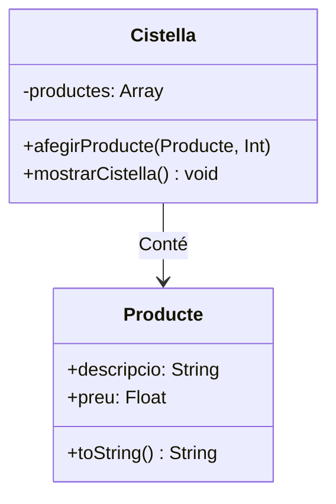

# La cistella de nadal. Part 1. 🎄
*Una activitat de programació per fer entre torró i torró*

Anem a crear una senzilla aplicació en NodeJS per gestionar una **cistella de Nadal**. L'aplicació permetrà afegir productes, mostrar el contingut de la cistella i calcular el preu total.

Gran part del codi, i l'esquema general ja se us proporciona fet. La vostra feina consistirà en completar les **classes** i **funcions** que falten al projecte, segons les instruccions indicades en els comentaris del codi:

1. Implementar una **classe Producte**, per als productes que contindrà la cistella,
2. Implementar una **classe Cistella**, amb els productes de la cistella,
3. Completar la funcionalitat per **afegir productes** i **mostrar la cistella**.

A més, el codi proporcionat ens servirà per familiaritzar-nos amb l'entrada de dades per terminal i treballar amb vectors/llistes en JavaScript.


<!--
## **Requisits**

Per executar i treballar en el projecte, necessites:

- **Node.js** instal·lat.
- Coneixements bàsics de **JavaScript** i **classes**.
- **readline-sync** (ja està inclòs al projecte).

---
-->

## **Instruccions d'instal·lació**

1. **Clona** el repositori i acceeix a ell:

   ```bash
   git clone https://github.com/joamuran/LMI_EDD_Exercici_cistella.git
   cd cistella-nadal
   ```

2. **Instal·la les dependències**. El projecte depèn de la llibreria `readline-sync`, que ens permet llegir línies des del terminal de manera síncrona (de manera semblant a com ho fem en java). Així que per instal·lar-la haurem de fer:

   ```bash
   npm install
   ```

3. I per execuatar el programa, podeu fer ús de l'script *start* definit al `package.json`:

   ```bash
   npm start
   ```

---

## Detalls d'implementació

### Classe **Producte**

Aquesta contindrà:

- **Propietats**:
   - `descripcio`: la descripció del producte.
   - `preu`: el preu unitari del producte.

- **Mètode**:
   - `toString()`: Retorna un text amb el format següent:

     ```plaintext
     <descripcio> - <preu> €
     ```

### Classe **Cistella**

Aquesta contindrà:

- **Propietats**:
   - `productes`: un vector buit inicialment, on es guardaran objectes amb el format:
   
     ```javascript
     { producte, quantitat }
     ```

- **Mètodes**:
   - `afegirProducte(producte, quantitat)`: Afig un producte i una quantitat al vector.

     Exemple d'ús:
     ```javascript
     this.productes.push({ producte, quantitat: parseInt(quantitat) });
     ```

   - `mostrarCistella()`: Mostra el contingut de la cistella, utilitzant el mètode `toString` de cada producte. També calcularà:

     - **Subtotal** per cada línia (preu × quantitat).
     - **Total** final de la cistella.

### Relació entre les classes




### La Funció **afegirProducte**

El funcionament de la funció `afegirProducte` del programa principal, serà el següent:

1. Llig les dades del producte (nom, preu, quantitat) des de la terminal (es proporciona fet)
2. Crea un objecte de la classe `Producte`.
3. L'afig a la cistella utilitzant el mètode `afegirProducte`.

### La Funció **mostrarCistella**

A l'ordre `show`, crida al mètode `mostrarCistella` de la cistella per mostrar:

1. Cada producte amb la seva quantitat i subtotal.
2. El **preu total** al final.

## **Ordres de l'Aplicació**

L'aplicació permetrà les següents ordres:

- **`help`**: Mostra l'ajuda.
- **`add`**: Afig un nou producte a la cistella.
- **`show`**: Mostra el contingut de la cistella i el preu total.
- **`exit`**: Ix de l'aplicació.

Aquestes s'implementen en un bucle que es repeteix infinitament, mentre no s'intrudiosca l'ordre exit, i anirà demanant-nos les ordres com un prompt del sistema.

## **Exemple d'Execució**

```plaintext
🎄 Benvingut a l'aplicació de la Cistella de Nadal! 🎄

🎄> help

Ajuda. Ordres permeses:

    help: Mostra aquesta ajuda
    exit: Ix de l'aplicació
    add: Afig un nou producte a la cistella
    show: Mostra el contingut de la cistella

🎄> add
Nom del producte: Torró de Xixona
Preu del producte: 12.50
Nombre d'unitats: 2
✅ Producte afegit correctament!

🎄> show

--- Contingut de la Cistella ---
1. Torró de Xixona - 12.50 € x 2 unitats - Subtotal: 25.00 €

Preu Total: 25.00 €

🎄> exit
Bon Nadal!
```

