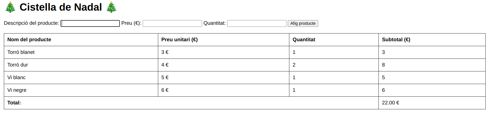

# Aplicant el DOM a la cistella de nadal

Anem a crear la primera versió de la **Cistella de Nadal** al navegador, utilitzant les eines que ens proporciona el **DOM** i els conceptes vists a aquest apartat.Desenvoluparem una aplicació senzilla que permetrà mostrar el contingut de la cistella i afegir productes directament des d'un formulari HTML.

Així doncs, la nostra pàgina inclourà:

* **Un formulari** per afegir productes a la cistella.
* **Una taula** que mostrarà el contingut de la cistella.
* **Càlcul automàtic** del total dels productes.

A més, continuarem l'exercici anterior, de manera que seguirem fent ús de **classes** per implementar la funcionalitat de la cistella i dels productes.

Disposeu de l'estructura de la pàgina web, i d'un CSS bàsic, l'estrucutra i aspecte dels quals podeu modificar al voste fust.

## Detalls d'implementació

Recorem que la classe `Producte` conté dues propietats: `descripcio` i `preu`, així com el mètode `constructor` i el mètode `toString()`, i la classe `Cistella` conté una llista (vector) d'objectes de tips `Producte`, i ofereix els mètodes `constructor`, `afegirProducte` i `mostrarCistella`.

El nou javascript partirà d'aquestes dues classes, tal i com les tenim, però ara:

* La classe `Producte`  incorporarà:
  * Una propietat *quantitat* amb les unitats del producte que s'han afegit,
  * Un nou mètode `CalculaSubtotal` que retorna el *preu* del producte per la *quantitat*
  * Un nou mètode `generaHTML`, que crea una representació visual del producte en forma de fila per a la taula.

* La classe `Cistella`:
  * Modificarà la llista per a que siga directament una llista de *Producte*, no un JSON amb `{producte, quantitat}`, ja que ara la quantitat es guarda al mateix producte.
  * Al mètode `afegirProducte(producte)`, ara només rebrem el producte, que ja incorpora la quantitat. A més, quan afegim un producte a la llista, caldrà generar l'HTML corresponent a l'element que acabem d'afegir i actualitzar el preu total. Podem incorporar un mètode `actualitzaTotal()` que realitze aquesta funció.

Recordeu que, a través del DOM podem:

* **Accedir** als elements del formulari i de la taula utilitzant mètodes com `document.getElementById` o `document.querySelector`. **Per tal d'accedir al valor d'aquests, farem ús de la propietat `value`**.
* **Crear i modificar** elements HTML com les files de la taula utilitzant mètodes com `createElement` i `appendChild`.

El resultat serà semblant al següent:

